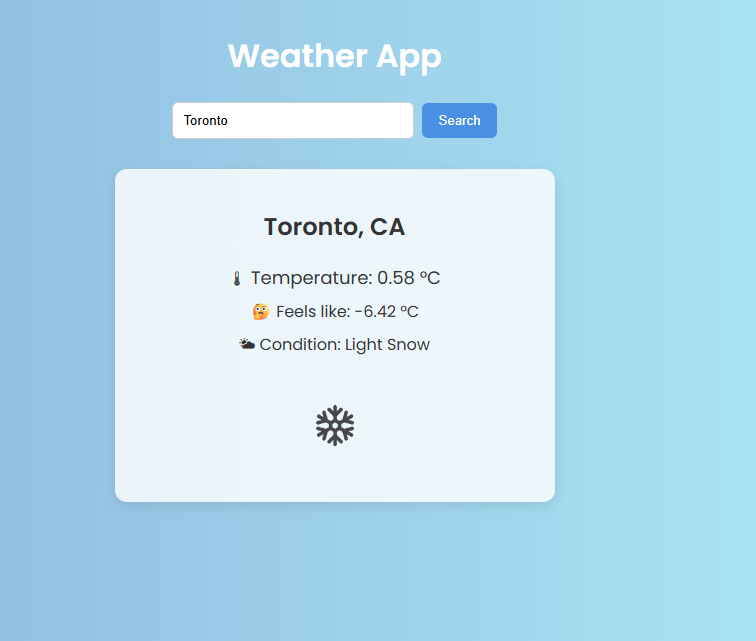
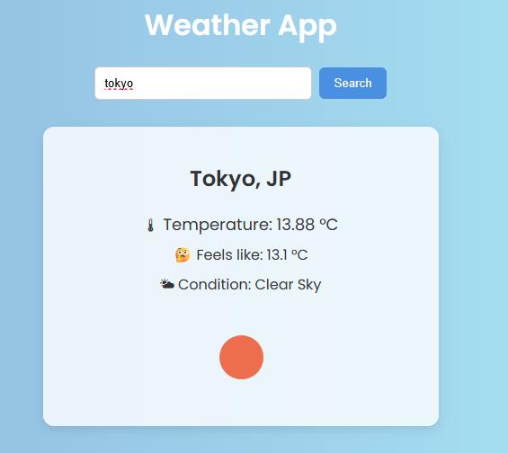

# 1043915_comp3123_labtest2

Name:Regina Slonimsky
Student #: 101491915 
Course: COMP3123

##  Weather App — COMP3123 Lab Test 2

Real-time weather data using the OpenWeatherMap API. Users can search by city and view temperature & weather conditions

---

## Setup Instructions

1. Clone the repo:
   git clone https://github.com/ginageegee/1043915_comp3123_labtest2.git
   cd 1043915_comp3123_labtest2
2. Install dependencies (npm install)
3. Create .env
4. Start app (npm start)

Hosted on vercel
https://101491915-comp3123-labtest2-git-main-ginageegees-projects.vercel.app/

Api used
https://openweathermap.org/current

